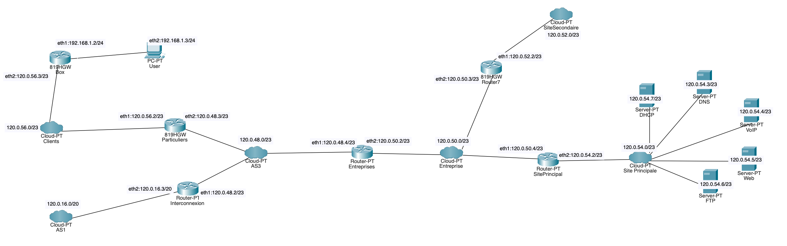

# Projet Interconnexion – Network Interconnection (2A S7)

Design and emulation, with Docker containers, of an interconnected network made of
an ISP backbone, a company with a main and a secondary site, and home customers.



## Components (`Project/`)

| Container | Role |
|---|---|
| `Routeur_Interco`, `Routeur_Entreprises`, `Routeur_Particulier` | Backbone / access routers |
| `Routeur_SiteP`, `Routeur_SiteS` | Main and secondary company-site routers (DHCP relay on site P) |
| `BOX`, `BOX_VPN` | Customer box: NAT + iptables firewall (ICMP, DHCP, DNS, HTTP, FTP allowed) |
| `Serveur_DHCP`, `Serveur_DNS` / `DNS_Server` | Address allocation and `groupe3.com` DNS zone (BIND) |
| `Serveur_WEB`, `Serveur_FTP`, `Serveur_VOIP` | Company services |
| `Serveur_VPN`, `Client_VPN` | WireGuard VPN between remote client and company |
| `Client`, `ClientSiteP` | Test clients |

Networks (created in `command.sh`): `Reseau_Client` 192.168.1.0/24,
`Reseau_Site_Principal` 120.0.54.0/23, `Reseau_Site_Secondaire` 120.0.52.0/23,
`Reseau_Entreprise` 120.0.50.0/23, `Reseau_AS1`, `Reseau_AS3`, `Reseau_Clients`.

## Running

```bash
cd Project
./command.sh   # WARNING: first removes ALL local Docker containers/images, then builds & starts everything
./start.sh     # configures routing, NAT and firewall rules inside the containers
```

Screenshots of the result: `conteneurs.png`, `images.png`, `pings.png`, `web.png`.
Full write-up: [`Rapport_Projet.pdf`](Rapport_Projet.pdf).

> The WireGuard keys under `Project/Serveur_VPN/` were generated for this lab only.
> Do not reuse them for a real VPN.
